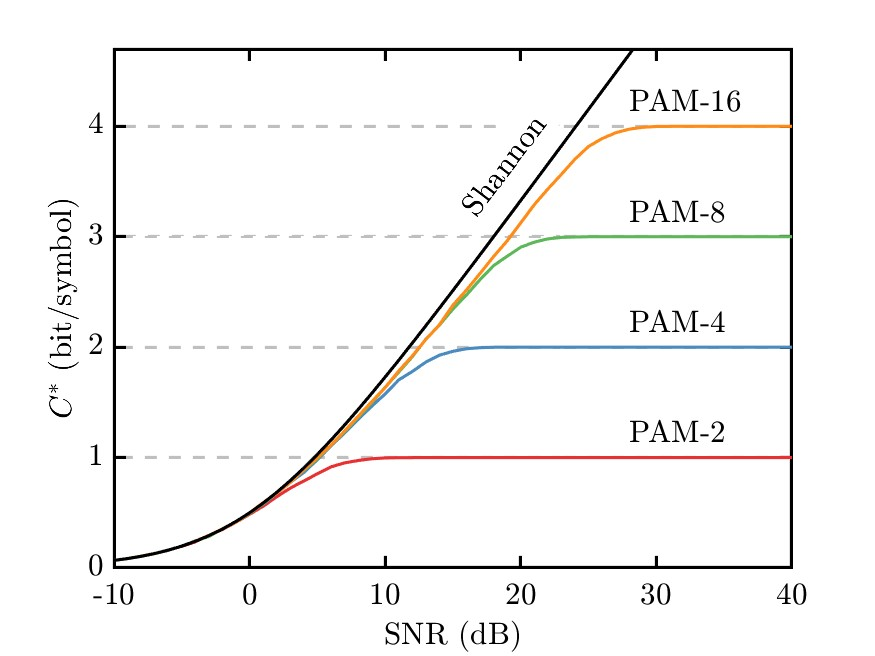
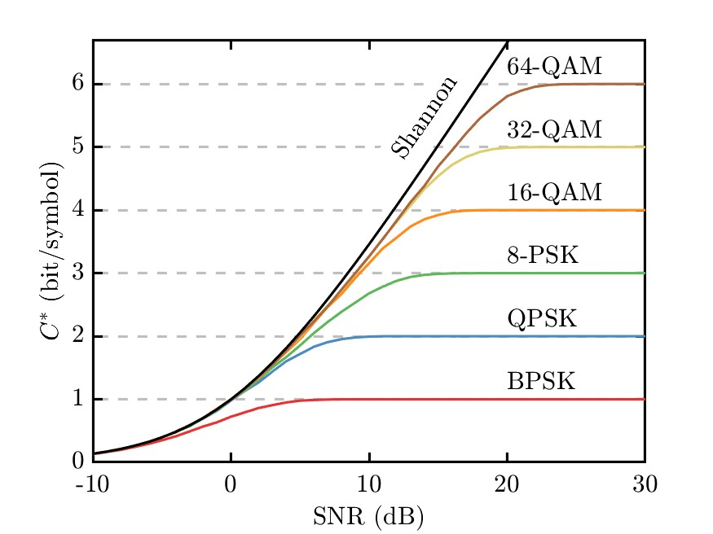
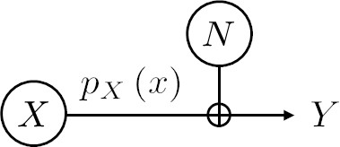

# Monte Carlo estimation of constellation-constrained capacity


<div class="hidden">

</div>

## Motivations

The function provided in this repository calculates the
constellation-constrained capacity for an ideal memoryless channel
limited by additive white Gaussian noise (AWGN).

It is to be used to reproduce classic textbook graphs showing the
“capacity” as a function of signal-to-noise ratio (SNR) for different
discrete constellations, such as the ones reproduced in
<a href="#fig-constellation_constrained_capacity_1d"
class="quarto-xref">Figure 1</a> for 1-dimensional (1D) constellations
and in <a href="#fig-constellation_constrained_capacity_2d"
class="quarto-xref">Figure 2</a> for 2-dimensional (2D) constellations.

<div id="fig-constellation_constrained_capacity_1d">




Figure 1: Constellation-constrained capacity for selected 1D
constellations.

</div>
<div id="fig-constellation_constrained_capacity_2d">




Figure 2: Constellation-constrained capacity for selected 2D
constellations.

</div>

## Constellation-constrained capacity for the AWGN channel

<div id="fig-awgn_model_for_capacity">




Figure 3: AWGN channel model.

</div>

We consider a discrete-time channel impaired by additive noise, as
schematically represented in
<a href="#fig-awgn_model_for_capacity" class="quarto-xref">Figure 3</a>.
Here, the information source is represented by the random variable $X$

<span id="eq-it_additive_noise_model_receiver_source">$$
Y = X + N.
 \qquad(1)$$</span>

For a discrete memoryless channel, the capacity can be calculated by
maximising the mutual information over all possible input distributions
$p_X\left(x\right)$,

<span id="eq-it_def_capacity_max_mi">$$
C = \max_{p_X} I\left(X;Y\right).
 \qquad(2)$$</span>

In case of AWGN, this leads to the well-known expression for the
capacity, which for one-dimensional signals (real-valued signal and
noise) is expressed as

<span id="eq-it_capacity_awgn_sigmax_sigman">$$
C = \frac{1}{2}\log_2\left(1 + \frac{\sigma_x^2}{\sigma_n^2}\right).
 \qquad(3)$$</span>

where $\sigma_x^2$ is the mean power of the signal and $\sigma_n^2$ is
the noise variance, or, equivalently

<span id="eq-it_capacity_awgn_real_channel_bit_per_symbol">$$
C = \frac{1}{2}\log_2\left(1 +\mathrm{SNR}\right).
 \qquad(4)$$</span>

where $\mathrm{SNR}$ is the signal-to-noise ratio.

We also know from the maximisation of the mutual information in the
derivation of
(<a href="#eq-it_capacity_awgn_sigmax_sigman" class="quarto-xref">3</a>)
that the capacity is achieved when the input distribution is Gaussian.

However, in digital communications, discrete constellations consisting
of a finite set of symbols are used, e.g. pulse amplitude modulation
(PAM), quadrature amplitude modulation (QAM), etc. This introduces some
practical constraints on the achievable throughput over the AWGN
channel.

This throughput, or “constrained-capacity”, is then

<span id="eq-it_capacity_constellation_constrained_def">$$
C^* = I\left(X;Y\right)
 \qquad(5)$$</span>

for the chosen discrete input distribution.

We now have a system according to
<a href="#fig-awgn_model_for_capacity" class="quarto-xref">Figure 3</a>
where the source $X$ is discrete and the source $Y$ is continuous. In
this case, the mutual information can be expressed according to

<span id="eq-it_mutual_information_discrete_input_continuous_output">$$
I\left(X;Y\right) = \sum_{x\in\mathcal{X}} \int_{-\infty}^{+\infty} p\left(x,y\right) \log_2\left(\frac{p\left(x,y\right)}{p\left(x\right) p\left(y\right)}\right)\mathop{}\!\mathrm{d}y.
 \qquad(6)$$</span>

where $p\left(x\right)$ is the probability mass function of the random
variable $X$, $p\left(y\right)$ the probability density function of the
random variable $Y$ and $p\left(x,y\right)$ is the joint probability
density function of $X$ and $Y$.

Exploiting

<span id="eq-it_cc_total_prob">$$
  p\left(y\right) = \sum_{z\in\mathcal{X}} p\left(y|z\right) p\left(z\right),
 \qquad(7)$$</span>

and

<span id="eq-it_cc_joint">$$
 p\left(x,y\right) = p\left(y|x\right) p\left(x\right),
 \qquad(8)$$</span>

the mutual information can be expressed uniquely as a function of the
transition probabilities $p\left(y|x\right)$ that describe the action of
the channel

<span id="eq-mi_transition">$$
I\left(X;Y\right) = \frac{1}{M} \sum_{x\in\mathcal{X}} \int_{-\infty}^{+\infty} p\left(y|x\right) \log_2 \frac{p\left(y|x\right)}{\frac{1}{M}\sum_{z \in \mathcal{X}} p\left(y|z\right)} \mathop{}\!\mathrm{d}y.
 \qquad(9)$$</span>

Here we have assumed that the symbols are transmitted with the same
probability, $p\left(x\right) = 1/M$. This corresponds to the use of
uniform constellations, as opposed to probabilistic shaping.

In the case of the AWGN channel, the transition probabilities are known

<span id="eq-it_transition_probability_awgn_channel_1d_2d">$$
  p\left(y|x\right) =
  \begin{cases}
    \frac{1}{\sqrt{2\pi}\sigma} e^{-\frac{\left|y - x\right|^2}{2\sigma^2}}, & \mbox{1D constellations} \\
    \frac{1}{2\pi\sigma^2} e^{-\frac{\left|y - x\right|^2}{2\sigma^2}}, & \mbox{2D constellations},
  \end{cases}
 \qquad(10)$$</span>

where $\sigma^2$ is the noise variance per quadrature (i.e. the total
noise power is $\sigma^2$ for 1D constellations and $2\sigma^2$ for 2D
constellations). The mutual information can then be expressed as

<span id="eq-mi_intermediary">$$
  I\left(X;Y\right) = \frac{1}{M}\sum_{k=1}^{M} \int_{-\infty}^{+\infty} p\left(y|x\right) \log_2\left[\frac{e^{-\frac{\left|n\right|^2}{2\sigma^2}}}{\frac{1}{M}\sum_{i=1}^{M}e^{-\frac{\left|x_k + n - x_i\right|^2}{2\sigma^2}}}\right] \mathop{}\!\mathrm{d}y,
 \qquad(11)$$</span>

which can be cast under the form

<span id="eq-it_constellation_constrained_capacity_ungerboeck_form">$$
  I\left(X;Y\right) = \log_2 M - \frac{1}{M}\sum_{k=1}^{M} \mathbb{E}\left[\log_2\sum_{i=1}^{M} e^{-\frac{\left|x_k + n - x_i\right|^2 - \left|n\right|^2}{2\sigma^2}}\right],
 \qquad(12)$$</span>

as presented in  \[1\].

The second term can be evaluated numerically through averaging over
multiple realisations of the Gaussian random variable $n$, which is the
purpose of the function provided in this repository.

## Function usage

``` matlab
[constellation, norm_es,norm_emax] = define_constellation(type,m);
cstar = calc_constellation_constrained_capacity(constellation,snr,nquad,nreal);
```

The function `define_constellation(type,m)`, which is reproduced from
our [optical communication systems
library](https://github.com/cpeucher/optsyssim) define some standard
constellations.

`type` is the type of the constellation. Since the
`define_constellation`function was written for more general purposes,
the type includes both the shape of the constellation and the mapping.
As far as the calculation of the constrained-capacity of uniform
constellations is concerned, the mapping is irrelevant as long as
$p\left(x\right)= 1/M$). Thus `type = qpsk_natural` and
`type = qpsk_gray`will result in the same $C^*$. The function defines
standard PAM and QAM constellations. See the function header for a more
detailed description.

The constellations are generated over a standard grid
$\ldots , -7, -3, -1, 1, 3, 7, \ldots$ in both dimensions.

The
`calc_constellation_constrained_capacity(constellation,snr,nquad,nreal)`
calculates the constrained capacity according
to(<a href="#eq-it_constellation_constrained_capacity_ungerboeck_form"
class="quarto-xref">12</a>) for the values of SNR specified in `snr` and
the number of noise quadratures `nquad`. The calculation is conducted
over `nreal` realisations of additive white Gaussian noise for each SNR
value.

Examples:

``` matlab
[constellation, ~, ~] = define_constellation('pam4_natural',4);
cstar = calc_constellation_constrained_capacity(constellation,snr,1,10000);
```

``` matlab
[constellation, ~, ~] = define_constellation('qpsk_natural',4);
cstar = calc_constellation_constrained_capacity(constellation,snr,2,10000);
```

``` matlab
[constellation, ~, ~] = define_constellation('qam16_natural',16);
cstar = calc_constellation_constrained_capacity(constellation,snr,2,10000);
```

See the example scripts:

- [plot_constellation_constrained_capacity_1d.m](./examples/plot_constellation_constrained_capacity_1d.m)
- [plot_constellation_constrained_capacity_2d.m](./examples/plot_constellation_constrained_capacity_2d.m)

Note:

The scripts use the
[linspecer](https://www.mathworks.com/matlabcentral/fileexchange/42673-beautiful-and-distinguishable-line-colors-colormap)
function to generate distinguishable line colours.

## References

<div id="refs" class="references csl-bib-body" entry-spacing="0">

<div id="ref-Ungerboeck_tit_82_v28_p55" class="csl-entry">

<span class="csl-left-margin">1.
</span><span class="csl-right-inline">G. Ungerboeck, "Channel coding
with multilevel/phase signals," IEEE Trans. Inf. Theory **28**, 55–67
(1982) \[doi:
[10.1109/TIT.1982.1056454](https://doi.org/10.1109/TIT.1982.1056454)\].</span>

</div>

</div>
